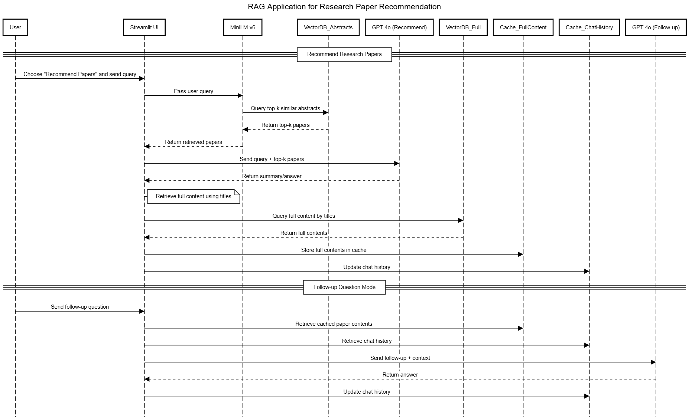

# 🧠 Research Paper Recommendation and Deep Reading (RAG App)

This is a Retrieval-Augmented Generation (RAG) application designed to recommend research papers based on user queries and allow in-depth exploration of the recommended content. The app uses local MiniLM-v6 embeddings and GPT-4o for generating intelligent responses. Built with §**Streamlit**, §**Pinecone**, and **OpenAI GPT**, it provides a simple interface to explore academic knowledge efficiently.

---

## 📊 Sequence Diagram



---

## 🚀 Features

### 1. Paper Recommendation

- Users input a query.
- MiniLM-v6 (stored locally) generates an embedding.
- Embedding is matched against a Pinecone vector database of paper §**abstracts and titles**.
- Top-k papers are passed to GPT-4o to generate a summary or recommendation.
- Full paper contents are fetched (using titles) and cached for later use.

### 2. Follow-up Questions

- User asks further questions.
- Cached §**full contents** and §**chat history** are used as context.
- GPT-4o provides a detailed response using the prior context.

---

## 🧱 Vector Database Structure

### 🔹 First Database: Abstracts and Titles (Recommendation)

Used for retrieving relevant papers based on the user's initial query.

```json
{
  "id": "vector_id",
  "values": [0.123, 0.456, ...],
  "metadata": {
    "title": "Paper Title",
    "authors": "Author List",
    "abstract_url": "https://...",
    "pdf_url": "https://..."
  }
}
```

### 🔹 Second Database: Full Paper Contents

Used for answering follow-up questions with deeper information.

```json
{
  "id": "uid",
  "values": [0.123, 0.456, ...],
  "metadata": {
    "paper_id": "2023_001",
    "title": "Paper Title",
    "year": 2023,
    "content": "Chunk of full paper text"
  }
}
```

---

## 🛠️ Tech Stack

- **LLM**: GPT-4o via OpenAI
- **Embedding Model**: MiniLM-v6 (stored locally)
- **Frontend**: Streamlit
- **Vector DB**: Pinecone
- **Paper Source**: Scraped using [ai_papers_scrapper](https://github.com/george-gca/ai_papers_scrapper)
- **Caching**: Paper contents cache and chat history cache

---

## 📂 Project Structure

```
.
├── assets/
│   └── rag-sequence.svg         # Sequence diagram
├── streamlit_app.py             # Main Streamlit app
│   
├── my_minilm_model              # Locally stored embedding model
│   
├── rag
│   ├── rag_module.py            # Perform RAG on recommending papers
│   └── vectorize_full_texts.py  # Perform RAG on reading the recommened papers
├── vectordb
│   ├── retrieve_vector.py       # Retrieve the abstracts and urls for recommending papers
│   └── retrieve_chunks.py       # Retrieve the full contents of the recommneded papers
├── requirements.txt
└── README.md
```

---

## 📦 Setup Instructions

### 1. Install Requirements

```bash
pip install -r requirements.txt
```

### 2. Set Up MiniLM-v6 Locally

Download and store MiniLM-v6 into the `models/minilm-v6/` directory for Streamlit caching.

### 3. Vector DB Initialization

Ensure Pinecone API keys are set and both vector indexes (abstracts and full texts) are initialized.

### 4. Run Streamlit App

```bash
streamlit run app/streamlit_app.py
```

---

## 💡 Future Improvements

- Add support for paper filtering (e.g., by year, conference)
- UI enhancements for better paper navigation

---

## 📄 License

This project is **not open source**.

All rights reserved. Use is strictly limited to **AvryG99 (Ha Gia Huy)**.  
Any other use, distribution, or modification is **prohibited without explicit written permission** from the copyright holder.

See the [LICENSE](./LICENSE.md) file for full details.

